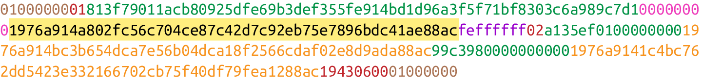

**original project:** [jimmysong - programming bitcoin](https://github.com/jimmysong/programmingbitcoin)

This is my own implementation in kotlin following the book: Programming Bitcoin - Jimmy Song

Thanks for your job Jimmy.

# PROGRAMMING BITCOIN SUMMARY
## Chapter 1 - Finite Fields
### Finite Field Definition

Mathematically, a finite field is defined as a finite set of numbers and two operations + (addition) and ⋅ (multiplication) that satisfy the following:

```
1. If a and b are in the set, a + b and a ⋅ b are in the set. We call this property closed.
2. 0 exists and has the property a + 0 = a. We call this the additive identity.
3. 1 exists and has the property a ⋅ 1 = a. We call this the multiplicative identity.
4. If a is in the set, –a is in the set, which is defined as the value that makes a + (–a)
   = 0. This is what we call the additive inverse.
5. If a is in the set and is not 0, a–1 is in the set, which is defined as the value that
   makes a ⋅ a–1 = 1. This is what we call the multiplicative inverse.
```
In math notation the finite field set looks like this:
```
Fp = {0, 1, 2, ... p–1}
```

Field has a prime order every time. For a variety of reasons that will become clear later, it turns out that fields must have an order that is a power of a prime, and that the finite fields whose order is prime are the ones we’re interested in.

### Modulo Arithmetic
The modulo operation is the remainder after division of one number by another.
```
1747 % 241 = 60
```
You can think of modulo arithmetic as “wraparound” or “clock” math.

Imagine a problem like this:
It is currently 3 o’clock. What hour will it be 47 hours from now?
The answer is 2 o’clock because

```
(3 + 47) % 12 = 2
```
The result of the modulo (%) operation for hours is always between 0 and 11

### Finite Field Addition and Subtraction

```
Fp = {0, 1, 2, ... p–1}, where a, b ∈ Fp
```

Addition being closed means:

```
a + b = (a + b) % p, where a, b ∈ Fp
```

For example(p = 19):

```
7 + 8 = (7 + 8) % 19 = 15
```

Additive inverse this way. 

```
a ∈ Fp implies that –a ∈ Fp:
–a = (–a) % p
–9 = (–9) % 19 = 10
```

Field subtraction:

```
a – b = (a – b) % p, where a, b ∈ Fp.
```

For example(p = 19):

```
11 – 9 =(11 - 9) % 19 = 2
```

### Finite Field Multiplication and Exponentiation
Examples for p = 19

Multiplication is adding multiple times:

```
5 ⋅ 3 = 5 + 5 + 5 = 15 % 19 = 15
8 ⋅ 17 = 8 + 8 + 8 + ... (17 total 8’s) ... + 8 = (8 ⋅ 17) % 19 = 136 % 19 = 3
```

Exponentiation using modulo arithmetic:]

```
7³ = 343 % 19 = 1
```

### Finite Field Division
In normal math, division is the inverse of multiplication:

```
7 ⋅ 8 = 56 implies that 56/8 = 7
12 ⋅ 2 = 24 implies that 24/12 = 2
```

In F19, we know that:

```
3 ⋅ 7 = 21 % 19 = 2 implies that 2/7 = 3
9 ⋅ 5 = 45 % 19 = 7 implies that 7/5 = 9
```

The question you might be asking yourself is, how do I calculate 2/7 if I don’t know beforehand that 3 ⋅ 7 = 2?

the answer is that n^(p–1) is always 1 for every p that is prime and every n > 0. This is a beautiful result from number theory called *Fermat’s little theorem*. Essentially, the theorem says:

```
n^(p–1) % p = 1, where p is prime.
```

Because division is the inverse of multiplication, we know:

```
a/b = a ⋅ (1/b) = a ⋅ b⁻¹
```

We can reduce the division problem to a multiplication problem as long as we can figure out what b⁻¹ is. This is where *Fermat’s little theorem* comes into play. We know:

```
b^(p–1) = 1
```

because p is prime. Thus:

```
b⁻¹ = b⁻¹ ⋅ 1 = b⁻¹ ⋅ b^(p–1) = b^(p–2)
or:
b⁻¹ = b^(p–2)
```

F19:

```
2/7 = 2 ⋅ 7^(19 – 2) = 2 ⋅ 717 = 465261027974414 % 19 = 3
```

## Chapter 2 - Elliptic Curves
### Definition
elliptic curves have a form like this:

```
y² = x³ + ax + b
```


### Point Addition
Elliptic curves are useful because of something called point addition. Point addition is where we can do an operation on two of the points on the curve and get a third point, also on the curve. This is called addition because the operation has a lot of the intuitions we associate with the mathematical operation of addition.

We can define point addition using the fact that lines intersect one or three times with the elliptic curve. Two points define a line, so since that line must intersect the curve one more time, that third point reflected over the x-axis is the result of the point addition.

So, for any two points P1 = (x1,y1) and P2 = (x2,y2), we get P1 + P2 as follows:

```
1. Find the point intersecting the elliptic curve a third time by drawing a line
through P1 and P2.
2. Reflect the resulting point over the x-axis.
```


One of the properties that we are going to use is that point addition is not easily predictable. We can calculate point addition easily enough with a formula, but intuitively, the result of point addition can be almost anywhere given two points on the curve.

A + B is to the right of both points, A + C would be somewhere between A and C on the x-axis, and B + C would be to the left of both points. In mathematics parlance, point addition is nonlinear.

### Math of Point Addition
Point addition satisfies certain properties that we associate with addition, such as:

```
1. Identity
2. Commutativity
3. Associativity
4. Invertibility
```

Identity here means that there’s a zero. That is, there exists some point I that, when added to a point A, results in A:

```
I + A = A
```
Call this point the point at infinity.

This is related to invertibility. For some point A, there’s some other point –A that results in the identity point. That is:

```
A + (–A) = I
```

Visually, these points are opposite one another over the x-axis on the curve:


This is why we call this point the point at infinity. We have one extra point in the elliptic curve, which makes the vertical line intersect the curve a third time.

Commutativity means that:

```
A + B = B + A 
```

This is obvious since the line going through A and B will intersect the curve a third time in the same place, no matter the order.

Associativity means that:

```
(A + B) + C = A + (B + C)
```

This isn’t obvious and is the reason for flipping over the x-axis.


### Point Addition for When x1 ≠ x2

```
P1 = (x1,y1), P2 = (x2,y2), P3 = (x3,y3)
P1 + P2 = P3
s = (y2 – y1)/(x2 – x1)
x3 = s² – x1 – x2
y3 = s(x1 – x3) – y1
```

### Point Addition for When P1 = P2

When the x coordinates are the same and the y coordinate is different, we have the situation where the points are opposite each other over the x-axis. We know that this means:

```
P1 = –P2 or P1 + P2 = I
```

What happens when P1 = P2? Visually, we have to calculate the line that’s tangent to the curve at P1 and find the point at which the line intersects the curve.


```
P1 = (x1,y1), P3 = (x3,y3)
P1 + P1 = P3
s = (3x1² + a)/(2y1)
x3 = s² – 2 ⋅ x
y3 = s(x1 – x3) – y1
```

And this involves the case where the tangent line is vertical:


This can only happen if P1 = P2 and the y coordinate is 0, in which case the slope calculation will end up with a 0 in the denominator.

```
If the two points are equal and the y coordinate is 0, we return the point at infinity.
```

## Chapter 3 - Elliptic Curve Cryptography

### Elliptic Curves over Reals

Real numbers are easy to plot on a graph. For example, y² = x³ + 7 can be plotted like:


### Elliptic Curves over Finite Fields

So what does an elliptic curve over a finite field look like? Let’s look at the equation y² = x³ + 7 over F103. We can verify that the point (17,64) is on the curve by calculating both sides of the equation:

```
y² = 642 % 103 = 79
x³ + 7 = (173+7) % 103 = 79
```

We’ve verified that the point is on the curve using finite field math.

Because we’re evaluating the equation over a finite field, the plot of the equation looks vastly different:


As you can see, it’s very much a scattershot of points and there’s no smooth curve here.

### Point Addition over Finite Fields

All of the equations for elliptic curves work over finite fields, which sets us up to create some cryptographic primitives.

### Scalar Multiplication for Elliptic Curves

Because we can add a point to itself, we can introduce some new notation:

```
(170,142) + (170,142) = 2 ⋅ (170,142)
```

Similarly, because we have associativity, we can actually add the point again:

```
2 ⋅ (170,142) + (170,142) = 3 ⋅ (170, 142)
```

We can do this as many times as we want. This is what we call scalar multiplication.

One property of scalar multiplication is that it’s really hard to predict without calculating. This is because point addition is nonlinear and not easy to calculate. Performing scalar multiplication is straightforward, but doing the opposite, point division, is not.

This is called the *discrete log problem* and is the basis of elliptic curve cryptography.

Another property of scalar multiplication is that at a certain multiple, we get to the point at infinity (remember, the point at infinity is the additive identity or 0). If we imagine a point G and scalar-multiply until we get the point at infinity, we end up with a set:

```
{ G, 2G, 3G, 4G, ... nG } where nG = 0
```

It turns out that this set is called a group, and because n is finite, we have a finite group (or more specifically, a finite cyclic group). Groups are interesting mathematically because they behave well with respect to addition:

```
G + 4G = 5G or aG + bG = (a + b)G
```

### Scalar Multiplication Redux

The key to making scalar multiplication into public key cryptography is using the fact that scalar multiplication on elliptic curves is very hard to reverse.

Scalar multiplication looks really random, and that’s what gives this equation asymmetry. An asymmetric problem is one that’s easy to calculate in one direction, but hard to reverse. For example, it’s easy enough to calculate **12 ⋅ (47,71)**. But if we were
presented with this:

```
s ⋅ (47,71) = (194,172)
```

We can look up the results, but that when we have numbers that are a lot larger, discrete log becomes an intractable problem.

### Mathematical Groups

What we actually want to generate for the purposes of public key cryptography are finite cyclic groups, and it turns out that if we take a generator point from an elliptic curve over a finite field, we can generate a finite cyclic group.

Unlike fields, groups have only a single operation. In our case, point addition is the operation. Groups also have a few other properties:

```
1. Identity
2. Closure
3. Invertibility
4. Commutativity
5. Associativity
```

#### Identity

The identity is defined as the point at infinity, which is guaranteed to be in the group since we generate the group when we get to the point at infinity.

```
0 + A = A
```

#### Closure

If we have two different elements that look like this:

```
aG + bG = (a + b)G
```

How do we know if this element is in the group? If a+b < n (where n is the order of the group), then we know it’s in the group by definition. If a+b >= n, then we know a < n and b < n, so a+b < 2n, so a+b–n < n:

```
(a + b – n)G = aG + bG – nG = aG + bG – 0 = aG + bG
```

More generally:

```
(a + b)G = ((a + b) % n)G, where n is the order of the group
```

So we know that this element is in the group, proving closure.

#### Invertibility

we know that if aG is in the group, (n – a)G is also in the group.

```
aG + (n – a)G = (a + n – a)G = nG = 0
```

#### Commutativity

This means that:

```
aG + bG = bG + aG
```

#### Associativity

```
aG + (bG + cG) = (aG + bG) + cG
```

### Defining the Curve for Bitcoin

An elliptic curve for public key cryptography is defined with the following parameters:

```
• We specify the a and b of the curve y² = x³ + ax + b.
• We specify the prime of the finite field, p.
• We specify the x and y coordinates of the generator point G.
• We specify the order of the group generated by G, n.
```

These numbers are known publicly and together form the cryptographic curve. There are many cryptographic curves and they have different security/convenience trade-offs, but the one we’re most interested in is the one Bitcoin uses: secp256k1. The parameters for secp256k1 are these:

```
• a = 0, b = 7, making the equation y² = x³ + 7
• p = 2²⁵⁶ – 2³² – 977
• Gx = 0x79be667ef9dcbbac55a06295ce870b07029bfcdb2dce28d959f2815b16f81798
• Gy = 0x483ada7726a3c4655da4fbfc0e1108a8fd17b448a68554199c47d08ffb10d4b8
• n = 0xfffffffffffffffffffffffffffffffebaaedce6af48a03bbfd25e8cd0364141
```

> How Big is 2²⁵⁶?
> 2²⁵⁶ doesn’t seem that big because we can express it succinctly, but in reality, it is an enormous number. To give you an idea, here are some relative scales:
> 2²⁵⁶ ~ 10⁷⁷
> • Number of atoms in and on Earth ~ 10⁵⁰
> • Number of atoms in the solar system ~ 10⁵⁷
> • Number of atoms in the Milky Way ~ 10⁶⁸
> • Number of atoms in the universe ~ 10⁸⁰
> A trillion (10¹²) computers doing a trillion computations every trillionth (10⁻¹²) of a
> second for a trillion years is still less than 10⁵⁶ computations.
> Think of finding a private key this way: there are as many possible private keys in Bitcoin as there are atoms in a billion galaxies.

### Public Key Cryptography

The key operation that we need is `P = eG`, which is an asymmetric equation.

Generally, we call `e` the private key and `P` the public key. Note here that the private key is a single 256-bit number and the public key is a coordinate (x,y), where x and y are each 256-bit numbers.

### Signing and Verification

To set up the motivation for why signing and verification exists, imagine this scenario. You want to prove that you are a really good archer, like at the level where you can hit any target you want within 500 yards as opposed to being able to hit any particular target.

Now, if someone could observe you and interact with you, proving this would be easy. Perhaps they would position your son 400 yards away with an apple on his head and challenge you to hit that apple with an arrow. You, being a very good archer, could do
this and prove your expertise. The target, if specified by the challenger, makes your archery skill easy to verify.

Unfortunately, this doesn’t scale very well. If, for example you wanted to prove this to 10 people, you would have to shoot 10 different arrows at 10 different targets from 10 different challenges. You could try to do something like have 10 people watch you shoot a single arrow, but since they can’t all choose the target, they can never be sure that you’re not just good at hitting one particular target instead of an arbitrary target. What we want is something that you can do once, that requires no interaction back and forth with the verifiers, but that still proves that you are indeed, a good archer that can hit any target.

If, for example, you simply shot an arrow into a target of your choosing, the people observing afterward wouldn’t necessarily be convinced. After all, you might have painted the target around wherever your arrow happened to land. So what can you do?

Here’s a very clever thing you can do. Inscribe the tip of the arrow with the position of the target that you’re hitting (“apple on top of my son’s head”) and then hit that target with your arrow. Now anyone seeing the target can take an X-ray machine and look at the tip of the embedded arrow and see that the tip indeed says exactly where it was going to hit. The tip clearly had to be inscribed before the arrow was shot, so this can prove you are actually a good archer (provided the actual target isn’t just one that you’ve practiced hitting over and over).

This is the same technique we’re using with signing and verification, except what we’re proving isn’t that we’re good archers, but that we know a secret number. We want to prove possession of the secret without revealing the secret itself. We do this by putting the target into our calculation and hitting that target.

Ultimately this is going to be used in transactions, which will prove that the rightful owners of the secrets are spending the bitcoins.

#### Inscribing the Target

The inscribing of the target depends on the signature algorithm, and in our case that algorithm is called the Elliptic Curve Digital Signature Algorithm, or ECDSA.

The secret in our case is e satisfying the following:

```
eG = P, where P is the public key and e is the private key.
```

The target that we’re going to aim at is a random 256-bit number, k.

```
kG = R
```

R is now the target that we’re aiming for. In fact, we’re only going to care about the x coordinate of R, which we’ll call r.

We claim at this point that the following equation is equivalent to the discrete log problem:

```
uG + vP = kG, where k was chosen randomly, u,v ≠ 0 can be chosen by the signer
uG + vP = kG implies vP = (k – u)G
P = ((k – u)/v)G
```

If we know e, we have:

```
eG = ((k – u)/v)G or e = (k – u)/v
```

This means that any (*u,v*) combination that satisfies the preceding equation will suffice. If we don’t know e, we’ll have to play with (*u,v*) until `e = (k–u)/v`. If we could solve this with any (*u,v*) combination, that would mean we’d have solved `P = eG` while knowing only P and G. In other words, we’d have broken the discrete log problem. This means to provide a correct *u* and *v*, we either have to break the discrete log problem or know the secret *e*.

The signature hash. A hash is a deterministic function that takes arbitrary data into data of fixed size. This is a fingerprint
of the message containing the intent of the shooter, which anyone verifying the message already knows. We denote this with the letter *z*. This is incorporated into our `uG + vP` calculation this way:

```
u = z/s, 
v = r/s
```

Since r is used in the calculation of v, we now have the tip of the arrow inscribed. We also have the intent of the shooter incorporated into u, so both the reason for shooting and the target that is being aimed at are now part of the equation.

```
uG + vP = R = kG
uG + veG = kG
u + ve = k
z/s + re/s = k
(z + re)/s = k
s = (z + re)/k
```

This is the basis of the signature algorithm, and the two numbers in a signature are *r* and *s*.

Verification is straightforward:

```
uG + vP where u,v ≠ 0
uG + vP = (z/s)G + (re/s)G = ((z + re)/s)G = ((z + re)/((z + re)/k))G = kG = (r,y)
```

#### Verification in Depth

Signatures sign some fixed-length value (our “contract”)—in our case, something that’s 32 bytes.

To guarantee that the thing we’re signing is 32 bytes, we hash the document first. In Bitcoin, the hashing function is *hash256*, or two rounds of *sha256*. This guarantees the thing that we’re signing is exactly 32 bytes. We will call the result of the hash the *signature hash*, or *z*.

```
1. We are given (r,s) as the signature, z as the hash of the thing being signed, and P as the public key (or public point) of the signer.
2. We calculate u = z/s, v = r/s.
3. We calculate uG + vP = R.
4. If R’s x coordinate equals r, the signature is valid.
```

#### Signing in Depth

Given that we know how verification should work, signing is straightforward. The only missing step is figuring out what k, and thus 

`R = kG`, to use. We do this by choosing a random k.

The signing procedure is as follows:

```
1. We are given z and know e such that eG = P.
2. Choose a random k.
3. Calculate R = kG and r = x coordinate of R.
4. Calculate s = (z + re)/k.
5. Signature is (r,s).
```

## Chapter 4 - Serialization

### Uncompressed SEC Format

There’s already a standard for serializing ECDSA public keys, called *Standards for Efficient Cryptography* (**SEC**)

Here is how the uncompressed SEC format for a given point P = (x,y) is generated:

```
1. Start with the prefix byte, which is 0x04.
2. Next, append the x coordinate in 32 bytes as a big-endian integer.
3. Next, append the y coordinate in 32 bytes as a big-endian integer.
```


### Compressed SEC Format

For any x coordinate, there are at most two y coordinates due to the y² term in the elliptic curve equation.

This is because for any (x,**y**) that satisfies y² = x³ + ax + b, (x,**–y**) also satisfies the equation. In a finite field, –y % p = (p – y) % p. Or, more accurately, if (x,y) satisfies the elliptic curve equation, (x,**p – y**) also satisfies the equation.

Between y and p – y, exactly one will be even and one will be odd.

Here is the serialization of the compressed SEC format for a given point P = (x,y):

```
1. Start with the prefix byte. If y is even, it’s 0x02; otherwise, it’s 0x03.
2. Next, append the x coordinate in 32 bytes as a big-endian integer.
```


The big advantage of the compressed SEC format is that it only takes up 33 bytes instead of 65 bytes. This is a big savings when amortized over millions of transactions.

How you can analytically calculate y given the x coordinate? This requires us to calculate a square root in a finite field.
Stated mathematically:

```
Find w such that w² = v when we know v.
```

It turns out that if the finite field prime:

```
p % 4 = 3 implies (p + 1) % 4 = 0. That is, (p + 1)/4 is an integer.
```

By definition:

```
w² = v
```

From Fermat’s little theorem:

```
w^(p-1) % p = 1
```

which means:

```
w² = w² ⋅ 1 = w² ⋅ w^(p-1) = w^(p+1)
```

Since p is odd (recall p is prime), we know we can divide (p+1) by 2 and still get an integer, implying:

```
w = w^[(p+1)/2]
```

Now we can use (p+1)/4 being an integer this way:

```
w = w^[(p+1)/2] = w^2[(p+1)/4] = (w²)^[(p+1)/4] = v^[(p+1)/4]
```

So our formula for finding the square root becomes:

```
if 
w² = v 
and 
p % 4 = 3 
w = v^[(p+1)/4]
```

It turns out that the p used in secp256k1 is such that p % 4 == 3, so we can use this formula.

### DER Signatures

The standard for serializing signatures (and lots of other things, for that matter) is called *Distinguished Encoding Rules* (**DER**) format.

DER signature format is defined like this:

```
1. Start with the 0x30 byte.
2. Encode the length of the rest of the signature (usually 0x44 or 0x45) and append.
3. Append the marker byte, 0x02.
4. Encode r as a big-endian integer, but prepend it with the 0x00 byte if r’s first byte ≥ 0x80. Prepend the resulting length to r. Add this to the result.
5. Append the marker byte, 0x02.
6. Encode s as a big-endian integer, but prepend with the 0x00 byte if s’s first byte ≥ 0x80. Prepend the resulting length to s. Add this to the result.
```

The rules for #4 and #6 with the first byte starting with something greater than or equal to 0x80 are because DER is a general encoding and allows for negative numbers to be encoded. The first bit being 1 means that the number is negative. All numbers in an ECDSA signature are positive, so we have to prepend with 0x00 if the first bit is zero, which is equivalent to first byte ≥ 0x80.


Because we know r is a 256-bit integer, r will be at most 32 bytes expressed as big-endian. It’s also possible the first byte could be ≥ 0x80, so #4 can be at most 33 bytes. However, if r is a relatively small number, it could be less than 32 bytes. The same goes for s and #6.

### Base58

#### Transmitting Your Public Key

All numbers, uppercase letters, and lowercase letters are utilized, except for the aforementioned 0/O and l/I. That leaves us with 10 + 26 + 26 – 4 = 58. Each of these characters represents a digit in Base58.

### Address Format

To both shorten the address and increase security, we can use the ripemd160 hash.

By not using the SEC format directly, we can go from 33 bytes to 20 bytes, shortening the address significantly. Here is how a Bitcoin address is created:

```
1. For mainnet addresses, start with the prefix 0x00, for testnet 0x6f.
2. Take the SEC format (compressed or uncompressed) and do a sha256 operation followed by the ripemd160 hash operation, the combination of which is called a hash160 operation.
3. Combine the prefix from #1 and resulting hash from #2.
4. Do a hash256 of the result from #3 and get the first 4 bytes.
5. Take the combination of #3 and #4 and encode it in Base58.
```

The result of step 4 of this process is called the checksum.

### WIF Format

The private key in our case is a 256-bit number. There are instances where you may want to transfer your private key from one wallet to another.

For this purpose, you can use Wallet Import Format (WIF). WIF is a serialization of the private key that’s meant to be human-readable. WIF uses the same Base58 encoding that addresses use.

Here is how the WIF format is created:

```
1. For mainnet private keys, start with the prefix 0x80, for testnet 0xef.
2. Encode the secret in 32-byte big-endian.
3. If the SEC format used for the public key address was compressed, add a suffix of 0x01.
4. Combine the prefix from #1, serialized secret from #2, and suffix from #3.
5. Do a hash256 of the result from #4 and get the first 4 bytes.
6. Take the combination of #4 and #5 and encode it in Base58.
```

## Chapter 5 - Transactions

### Transaction Components

At a high level, a transaction really only has four components.

```
1. Version
2. Inputs
3. Outputs
4. Locktime
```

The version indicates what additional features the transaction uses, inputs define what bitcoins are being spent, outputs define where the bitcoins are going, and locktime defines when this transaction starts being valid.


The differently highlighted parts represent the version, inputs, outputs, and locktime, respectively.

### Version

It’s meant to give the receiver information about what the versioned thing is supposed to represent. The version number after the operating system helps you know what features it has and what APIs you can program against.


You may notice here that the actual value in hexadecimal is 01000000, which doesn’t look like 1. Interpreted as a little-endian integer, however, this number is actually 1

### Inputs

Each input points to an output of a previous transaction.


Bitcoin’s inputs are spending outputs of a previous transaction. That is, you need to have received bitcoins first to spend something. The inputs refer to bitcoins that belong to you. Each input needs two things:

```
• A reference to bitcoins you received previously
• Proof that these are yours to spend
```

The inputs field can contain more than one input. This is analogous to using either a single $100 bill to pay for a $70 meal, or a $50 and a $20. The former only requires one input (“bill”); the latter requires two. There are situations where there could be even more inputs. In our analogy, we could pay for a $70 meal with 14 $5 bills, or even 7,000 pennies. This would be analogous to 14 inputs or 7,000 inputs.

The number of inputs:


We can see that the byte is actually 01, which means that this transaction has one input. It may be tempting here to assume that it’s always a single byte, but it’s not. A single byte has 8 bits, so anything over 255 inputs will not be expressible in a single byte.

This is where varints come in. Varint is shorthand for variable integer, which is a way to encode an integer into bytes that range from 0 to 264 – 1. We could, of course, always reserve 8 bytes for the number of inputs, but that would be a lot of wasted space if we expect the number of inputs to be relatively small (say, under 200). This is the case with the number of inputs in a normal transaction, so using varints helps to save space.

```
• If the number is below 253, encode that number as a single byte (e.g., 100 → 0x64).
• If the number is between 253 and 216 – 1, start with the 253 byte (fd) and then encode the number in 2 bytes in little-endian (e.g., 255 → 0xfdff00, 555 → 0xfd2b02).
• If the number is between 216 and 232 – 1, start with the 254 byte (fe) and then encode the number in 4 bytes in little-endian (e.g., 70015 → 0xfe7f110100).
• If the number is between 232 and 264 – 1, start with the 255 byte (ff) and then encode the number in 8 bytes in little-endian (e.g., 18005558675309 → 0xff6dc7ed3e60100000).
```

Each input contains four fields. The first two fields point to the previous transaction output and the last two fields define how the previous transaction output can be spent.

```
• Previous transaction ID
• Previous transaction index
• ScriptSig
• Sequence
```

The **previous transaction ID is the hash256** of the previous transaction’s contents.

As we’ll see, each transaction has to have at least one output, but may have many. Thus, we need to define exactly which output within a transaction we’re spending, which is captured in the previous transaction index.

Note that the **previous transaction ID is 32 bytes** and that the **previous transaction index is 4 bytes.** Both are in little-endian.

The ScriptSig has to do with Bitcoin’s smart contract language, Script. think of the ScriptSig as opening a locked box—something that can only be done by the owner of the transaction output. The **ScriptSig field is a variable-length** field, not a fixed-length field like most of what we’ve seenso far. A variable-length field requires us to define exactly how long the field will be, which is why the field is preceded by a **varint telling us how long it is**.

The sequence was originally intended as a way to do what Satoshi called *“highfrequency trades”* with the locktime field. but is currently used with Replace-By-Fee (RBF) and OP_CHECKSEQUENCEVERIFY. The **sequence is also in little-endian and takes up 4 bytes**.


previous transaction ID, previous index, ScriptSig, and sequence

### Outputs

Outputs define where the bitcoins are going. Output serialization starts with how many outputs there are as a varint:


Each output has two fields:

```
• Amount 
• ScriptPubKey
```

The **amount** is the amount of bitcoins being assigned and is specified **in satoshis**, or 1/100,000,000ths of a bitcoin. The absolute maximum for the amount is the asymptotic limit of 21 million bitcoins in satoshis, which is 2,100,000,000,000,000 (2,100 trillion)
satoshis. This number is greater than 232 (4.3 billion or so) and is thus stored in 64 bits, or **8 bytes.** The amount is serialized **in little-endian**.

Think of the **ScriptPubKey as the locked box** that can only be opened by the holder of the key. It’s like a one-way safe that can receive deposits from anyone, but can only be opened by the owner of the safe. Like ScriptSig, ScriptPubKey is a **variable-length field** and is preceded by the length of the field in a **varint**.


A complete output field, showing the amount and ScriptPubKey

#### UTXO Set

> UTXO stands for unspent transaction output. The entire set of unspent transaction outputs at any given moment is called the UTXO set. The reason why UTXOs are important is because at any moment in time, they represent all the bitcoins that are
> available to be spent. In other words, these are the bitcoins that are in circulation. Full nodes on the network must keep track of the UTXO set, and keeping the UTXO set indexed makes validating new transactions much faster.
> For example, it’s easy to enforce a no-double-spending rule by looking up the previous transaction output in the UTXO set. If the input of a new transaction is using a transaction output that’s not in the UTXO set, that’s an attempt at a double-spend or a nonexistent output and thus invalid. Keeping the UTXO set handy is also very useful for validating transactions. we need to look up the amount and ScriptPubKey from the previous transaction output to validate transactions, so having these UTXOs handy can speed up transaction validation.

### Locktime

Locktime is a way to time-delay a transaction.

If the locktime is greater than or equal to 500,000,000, it’s a Unix timestamp. If it’s less than 500,000,000, it’s a block number.
This way, transactions can be signed but unspendable until a certain point in Unix time or block height is reached.

Note that locktime is ignored if the sequence numbers for every input are ffffffff.

The serialization is in l**ittle-endian and 4 bytes**.


The main problem with using locktime is that the recipient of the transaction has no certainty that the transaction will be good when the locktime comes. This is similar to a postdated bank check, which has the possibility of bouncing. The sender can spend the inputs prior to the locktime transaction getting into the blockchain, thus invalid ating the transaction at locktime.
The uses before BIP0065 were limited. BIP0065 introduced OP_CHECKLOCKTIMEVERIFY, which makes locktime more useful by making an output unspendable until a certain locktime.

### Transaction Fee

One of the consensus rules of Bitcoin is that for any non-coinbase transactions, the sum of the inputs has to be greater than
or equal to the sum of the outputs. This is because if every transaction had zero cost, there wouldn’t be any incentive for miners to include transactions in blocks. Fees are a way to incentivize miners to include transactions. Transactions not in blocks (so-called mempool transactions) are not part of the blockchain and are not final.

The transaction fee is simply the sum of the inputs minus the sum of the outputs. This difference is what the miner gets to keep. As **inputs don’t have an amount field**, we have to look up the amount. This requires access to the blockchain, specifically the **UTXO set**.

## Chapter 6 - Script

The ability to lock and unlock coins is the mechanism by which we transfer bitcoin. Locking is giving some bitcoins to some entity. Unlocking is spending some bitcoins that you have received.

### Mechanics of Script

Script is a stack-based language similar to Forth. It’s intentionally limited in the sense that it avoids certain features. Specifically, Script avoids any mechanism for loops and is therefore not Turing complete.

### How Script Works

Script is a programming language, and like most programming languages, it processes one command at a time. The commands operate on a stack of elements. There are two possible types of commands: elements and operations.

Elements are data. Technically, processing an element pushes that element onto the stack. Elements are byte strings of length 1 to 520. A typical element might be a DER signature or a SEC pubkey.

Operations do something to the data. They consume zero or more elements from the processing stack and push zero or more elements back to the stack.

After all the commands are evaluated, the top element of the stack must be nonzero for the script to resolve as valid. Having no elements in the stack or the top element being 0 would resolve as invalid. Resolving as invalid means that the transaction that includes the unlocking script is not accepted on the network.

### Parsing the Script Fields

Both the ScriptPubKey and ScriptSig are parsed the same way. If the byte is between 0x01 and 0x4b (75 in decimal) (whose value we call n), we read the next n bytes as an element. Otherwise, the byte represents an operation, which we have to look up.

There are many more opcodes, which are coded in op.py, and the full list can be found at https://en.bitcoin.it/wiki/Script.

#### Elements Longer Than 75 Bytes

You might be wondering what would happen if you had an element with a length greater than 0x4b (75 in decimal). There are three
specific opcodes for handling such elements: **OP_PUSHDATA1**, **OP_PUSHDATA2**, and **OP_PUSHDATA4**. OP_PUSHDATA1 means that the next byte contains how many bytes we need to read for the ele ment. OP_PUSHDATA2 means that the next 2 bytes contain how many bytes we need to read for the element. OP_PUSHDATA4 means that the next 4 bytes contain how many bytes we need to read for the element.

### Combining the Script Fields

The Script object represents the command set that requires evaluation. To evaluate a script, we need to combine the ScriptPubKey and ScriptSig fields. The lockbox (ScriptPubKey) and the unlocking mechanism (ScriptSig) are in different transactions. Specifically, the lockbox is where the bitcoins are received, and the unlocking script is where the bitcoins are spent. The input in the spending transaction points to the receiving transaction.


### Standard Scripts

There are many types of standard scripts in Bitcoin, including the following:

```
p2pk
	Pay-to-pubkey
p2pkh
	Pay-to-pubkey-hash
p2sh
	Pay-to-script-hash
p2wpkh
	Pay-to-witness-pubkey-hash
p2wsh
	Pay-to-witness-script-hash
```

Addresses are known script templates like these. Wallets know how to interpret various address types (p2pkh, p2sh, p2wpkh) and create the appropriate ScriptPubKeys. All of the examples here have a particular type of address format (Base58, Bech32) so wallets can pay to them.

#### p2pk

Pay-to-pubkey (p2pk) was used largely during the early days of Bitcoin. Most coins thought to belong to Satoshi are in p2pk UTXOs —that is, transaction outputs whose ScriptPubKeys have the p2pk form.

Specifying where the bitcoins go is the job of the ScriptPubKey—this is the lockbox that receives the bitcoins.


For p2pk, the ScriptSig required to unlock the corresponding ScriptPubKey is the signature followed by a single sighash byte.


The ScriptPubKey and ScriptSig combine to make a command set that looks like:


The two columns in are Script commands and the elements stack. At the end of the processing, the top element of the stack must be nonzero to be considered a valid ScriptSig. The Script commands are processed one at a time.


The first command is the signature, which is an element. This is data that is pushed to the stack


The second command is the pubkey, which is also an element. Again, this is data that is pushed to the stack


OP_CHECKSIG consumes two stack commands (pubkey and signature) and determines if they are valid for this transaction. OP_CHECKSIG will push a 1 to the stack if the signature is valid, and a 0 if not. Assuming that the signature is valid for this public key


We’re finished processing all the Script commands, and we’ve ended up with a single element on the stack. Since the top element is nonzero (1 is definitely not 0), this script is valid.
If this transaction instead had an invalid signature, the result from OP_CHECKSIG would be 0

#### p2pkh

Pay-to-pubkey-hash was used during the early days of Bitcoin, though not as much as p2pk.
The p2pkh ScriptPubKey, or locking script.


Like p2pk, OP_CHECKSIG is here and OP_HASH160 makes an appearance. Unlike p2pk, the SEC pubkey is not here, but a 20-byte hash is. There is also a new opcode here: OP_EQUALVERIFY.

The p2pkh ScriptSig, or unlocking script.


Like p2pk, the ScriptSig has the DER signature. Unlike p2pk, the ScriptSig also has the SEC pubkey. The main difference between p2pk and p2pkh ScriptSigs is that the SEC pubkey has moved from the ScriptPubKey to the ScriptSig.

The ScriptPubKey and ScriptSig combine to form a list of commands.


## CHAPTER 7 - Transaction Creation and Validation

### Validating Transactions

The main things that a node checks:

```
1. The inputs of the transaction are previously unspent.
2. The sum of the inputs is greater than or equal to the sum of the outputs.
3. The ScriptSig successfully unlocks the previous ScriptPubKey.
```

#### Checking the Spentness of Inputs

To prevent double-spending, a node checks that each input exists and has not been spent. This can be checked by any full node by looking at the ***UTXO set***.

In Bitcoin, we can determine whether an input is being double-spent by keeping track of the UTXOs. If an input is in the UTXO set, that transaction input both exists and is not double-spending. If the transaction passes the rest of the validity tests, then we remove all the inputs of the transaction from the UTXO set.

#### Checking the Sum of the Inputs Versus the Sum of the Outputs

Nodes also make sure that the sum of the inputs is greater than or equal to the sum of the outputs. This ensures that the transaction does not create new coins. The one exception is a *coinbase transaction*. Since inputs don’t have an amount field, this must be looked up on the blockchain.

#### Checking the Signature

A transaction typically has at least one signature per input. If there are multisig outputs being spent, there may be more than one. As we learned in Chapter 3, the ECDSA signature algorithm requires the public key P, the signature hash z, and the signature (r,s). Once these are known, the process of verifying the signature is pretty simple.

SEC public keys and DER signatures are in the stack when a command like OP_CHECKSIG is executed, making getting the public key and signature pretty straightforward. The hard part is getting the signature hash. A naive way to do this
would be to hash the transaction serialization.


Unfortunately, we can’t do that, since the signature is part of the ScriptSig*(A signature is in the yellow highlighted part)* and a signature can’t sign itself.

Instead, we modify the transaction before signing it. That is, we compute a different signature hash for each input.

##### Step 1: Empty all the ScriptSigs

The first step is to empty all the ScriptSigs when checking the signature. The same procedure is used for creating the signature, except the ScriptSigs are usually already empty.


Note that this example has only one input, so only that input’s ScriptSig is emptied, but it’s possible to have more than one input. In that case, each of those would be emptied.

##### Step 2: Replace the ScriptSig of the input being signed with the previous ScriptPubKey

Each input points to a previous transaction output, which has a ScriptPubKey.


We take the ScriptPubKey that the input is pointing to and put that in place of the empty ScriptSig. This may require a lookup on the blockchain, but in practice the signer already knows the ScriptPubKey, as the input is one where the signer has the private key.


##### Step 3: Append the hash type

Last, we add a 4-byte hash type to the end. This is to specify what the signature is authorizing. The signature can authorize this input to go with all the other inputs and outputs (SIGHASH_ALL), go with a specific output (SIGHASH_SINGLE), or go with any output whatsoever (SIGHASH_NONE). The latter two have some theoretical use cases, but in practice, almost every transaction is signed with SIGHASH_ALL. There’s also a rarely used hash type called SIGHASH_ANYONECANPAY that can be combined with any of the previous three, which we won’t get into here. For SIGHASH_ALL, the final transaction must have the exact outputs that were signed or the input signature is invalid.

The integer corresponding to SIGHASH_ALL is 1 and this has to be encoded in little-endian over 4 bytes, which makes the modified transaction look like:



Append the hash type (SIGHASH_ALL), or the brown 01000000.

The hash256 of this modif`ied transaction is interpreted as a big-endian integer to produce z.

> **Quadratic Hashing**
> The signature hashing algorithm is inefficient and wasteful. The quadratic hashing problem states that time required to calculate the signature hashes increases quadratically with the number of inputs in a transaction. Specifically, not only will the number of hash256 operations for calculating z increase on a per-input basis, but in addition, the length of the transaction will increase, slowing down each hash256 operation because the entire signature hash will need to be calculated anew for each input. This was particularly obvious with the biggest transaction mined to date:
>
> bb41a757f405890fb0f5856228e23b715702d714d59bf2b1feb70d8b2b4e3e08
>
> This transaction had 5,569 inputs and 1 output and took many miners over a minute to validate, as the signature hashes for the transaction were expensive to calculate.
> Segwit (Chapter 13) fixes this with a different way of calculating the signature hash, which is specified in BIP0143.


Note that a full node would verify more things, like checking for double-spends and checking some other consensus rules not discussed in this chapter (max sigops, size of ScriptSig, etc.), but this is good enough for our library.

### Creating Transactions

Transactions we create will require the sum of the inputs to be greater than or equal to the sum of the outputs. Similarly,
transactions we create will require a ScriptSig that, when combined with the ScriptPubKey, will be valid.
To create a transaction, we need at least one output we’ve received. That is, we need an output from the UTXO set whose ScriptPubKey we can unlock. The vast majority of the time, we need one or more private keys corresponding to the public keys that
are hashed in the ScriptPubKey.

#### Constructing the Transaction

The construction of a transaction requires answering some basic questions:

```
1. Where do we want the bitcoins to go?
2. What UTXOs can we spend?
3. How quickly do we want this transaction to get into the blockchain?
```

> **Why Reusing Addresses Is a Bad Idea**
> Back in Chapter 6, we went through how p2pk was inferior to p2pkh, in part because it was only protected by ECDSA. p2pkh, on the other hand, is also protected by sha256 and ripemd160. However, because the blockchain is public, once we spend from a ScriptPubKey corresponding to our address, we reveal our public key as part of the ScriptSig. Once we’ve revealed that public key, sha256 and ripemd160 no longer protect us, as the attacker knows the public key and doesn’t have to guess it.
> As of this writing, we are still protected by the discrete log problem, which is unlikely to be broken any time soon. It’s important
> from a security perspective, however, to understand what we’re protected by.
> The other reason to not reuse addresses is for privacy. Having a single address for all our transactions means that people can link our transactions together. If, for example, we bought something private (say, medication to treat some disease we don’t want others to know about) and spent another output with the same ScriptPubKey for a donation to some charity, the charity and the medication vendor could identify that we had done business with the other.
> Privacy leaks tend to become security holes over time.

> **Fee Estimation**
>
> Fee estimation is done on a per-byte basis. If your transaction is 600 bytes, it will have double the fees as a transaction that’s 300 bytes. This is because block space is limited and larger transactions take up more space. This calculation has changed a bit since Segwit (see Chapter 13), but the general principle still applies. We want to pay enough on a per-byte basis so that miners are motivated to include our transaction as soon as possible.
> When blocks aren’t full, almost any amount above the default relay limit (1 satoshi/byte) is enough to get a transaction included. When blocks are full, this is not an easy thing to estimate. There are multiple ways to estimate fees, including:
>
> - Looking at various fee levels and estimating the probability of inclusion based on past blocks and the mempools at the time
> - Looking at the current mempool and adding a fee that roughly corresponds to enough economic incentivization
> - Going with some fixed fee
>
> Many wallets use different strategies, and this is an active area of research.

We need a way to take an address and get the **20-byte hash** out of it. This is the opposite of encoding an address.

We also need a way to convert the **20-byte hash to a ScriptPubKey**.

#### Signing the Transaction

Signing the transaction could be tricky, but we know how to get the signature hash, z, from earlier in this chapter. If we have the private key whose public key hash160s to the 20-byte hash in the ScriptPubKey, we can sign z and produce the DER signature.
