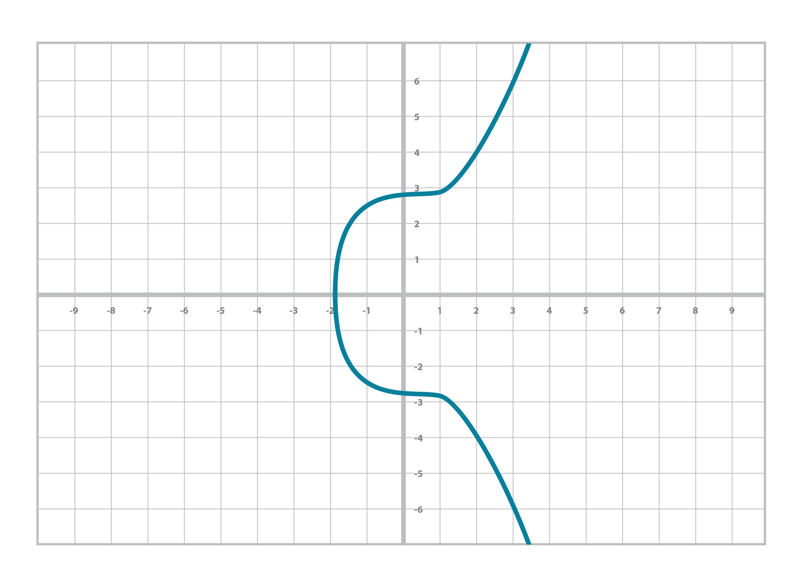

**original project:** [jimmysong - programming bitcoin](https://github.com/jimmysong/programmingbitcoin)

This is my own implementation in kotlin following the book: Programming Bitcoin - Jimmy Song

Thanks for your job Jimmy.

# PROGRAMMING BITCOIN SUMMARY
## Chapter 1 - Finite Fields
### Finite Field Definition

Mathematically, a finite field is defined as a finite set of numbers and two operations + (addition) and ⋅ (multiplication) that satisfy the following:

```
1. If a and b are in the set, a + b and a ⋅ b are in the set. We call this property closed.
2. 0 exists and has the property a + 0 = a. We call this the additive identity.
3. 1 exists and has the property a ⋅ 1 = a. We call this the multiplicative identity.
4. If a is in the set, –a is in the set, which is defined as the value that makes a + (–a)
   = 0. This is what we call the additive inverse.
5. If a is in the set and is not 0, a–1 is in the set, which is defined as the value that
   makes a ⋅ a–1 = 1. This is what we call the multiplicative inverse.
```
In math notation the finite field set looks like this:
```
Fp = {0, 1, 2, ... p–1}
```

Field has a prime order every time. For a variety of reasons that will become clear later, it turns out that fields must have an order that is a power of a prime, and that the finite fields whose order is prime are the ones we’re interested in.

### Modulo Arithmetic
The modulo operation is the remainder after division of one number by another.
```
1747 % 241 = 60
```
You can think of modulo arithmetic as “wraparound” or “clock” math.

Imagine a problem like this:
It is currently 3 o’clock. What hour will it be 47 hours from now?
The answer is 2 o’clock because

```
(3 + 47) % 12 = 2
```
The result of the modulo (%) operation for hours is always between 0 and 11

### Finite Field Addition and Subtraction

```
Fp = {0, 1, 2, ... p–1}, where a, b ∈ Fp
```

Addition being closed means:

```
a + b = (a + b) % p, where a, b ∈ Fp
```

For example(p = 19):

```
7 + 8 = (7 + 8) % 19 = 15
```

Additive inverse this way. 

```
a ∈ Fp implies that –a ∈ Fp:
–a = (–a) % p
–9 = (–9) % 19 = 10
```

Field subtraction:

```
a – b = (a – b) % p, where a, b ∈ Fp.
```

For example(p = 19):

```
11 – 9 =(11 - 9) % 19 = 2
```

### Finite Field Multiplication and Exponentiation
Examples for p = 19

Multiplication is adding multiple times:

```
5 ⋅ 3 = 5 + 5 + 5 = 15 % 19 = 15
8 ⋅ 17 = 8 + 8 + 8 + ... (17 total 8’s) ... + 8 = (8 ⋅ 17) % 19 = 136 % 19 = 3
```

Exponentiation using modulo arithmetic:]

```
7³ = 343 % 19 = 1
```

### Finite Field Division
In normal math, division is the inverse of multiplication:

```
7 ⋅ 8 = 56 implies that 56/8 = 7
12 ⋅ 2 = 24 implies that 24/12 = 2
```

In F19, we know that:

```
3 ⋅ 7 = 21 % 19 = 2 implies that 2/7 = 3
9 ⋅ 5 = 45 % 19 = 7 implies that 7/5 = 9
```

The question you might be asking yourself is, how do I calculate 2/7 if I don’t know beforehand that 3 ⋅ 7 = 2?

the answer is that n^(p–1) is always 1 for every p that is prime and every n > 0. This is a beautiful result from number theory called *Fermat’s little theorem*. Essentially, the theorem says:

```
n^(p–1) % p = 1, where p is prime.
```

Because division is the inverse of multiplication, we know:

```
a/b = a ⋅ (1/b) = a ⋅ b⁻¹
```

We can reduce the division problem to a multiplication problem as long as we can figure out what b⁻¹ is. This is where *Fermat’s little theorem* comes into play. We know:

```
b^(p–1) = 1
```

because p is prime. Thus:

```
b⁻¹ = b⁻¹ ⋅ 1 = b⁻¹ ⋅ b^(p–1) = b^(p–2)
or:
b⁻¹ = b^(p–2)
```

F19:

```
2/7 = 2 ⋅ 7^(19 – 2) = 2 ⋅ 717 = 465261027974414 % 19 = 3
```

## Chapter 2 - Elliptic Curves
### Definition
elliptic curves have a form like this:

```
y² = x³ + ax + b
```


### Point Addition
Elliptic curves are useful because of something called point addition. Point addition is where we can do an operation on two of the points on the curve and get a third point, also on the curve. This is called addition because the operation has a lot of the intuitions we associate with the mathematical operation of addition.

We can define point addition using the fact that lines intersect one or three times with the elliptic curve. Two points define a line, so since that line must intersect the curve one more time, that third point reflected over the x-axis is the result of the point addition.

So, for any two points P1 = (x1,y1) and P2 = (x2,y2), we get P1 + P2 as follows:

```
1. Find the point intersecting the elliptic curve a third time by drawing a line
through P1 and P2.
2. Reflect the resulting point over the x-axis.
```


One of the properties that we are going to use is that point addition is not easily predictable. We can calculate point addition easily enough with a formula, but intuitively, the result of point addition can be almost anywhere given two points on the curve.

A + B is to the right of both points, A + C would be somewhere between A and C on the x-axis, and B + C would be to the left of both points. In mathematics parlance, point addition is nonlinear.

### Math of Point Addition
Point addition satisfies certain properties that we associate with addition, such as:

```
1. Identity
2. Commutativity
3. Associativity
4. Invertibility
```

Identity here means that there’s a zero. That is, there exists some point I that, when added to a point A, results in A:

```
I + A = A
```
Call this point the point at infinity.

This is related to invertibility. For some point A, there’s some other point –A that results in the identity point. That is:

```
A + (–A) = I
```

Visually, these points are opposite one another over the x-axis on the curve:


This is why we call this point the point at infinity. We have one extra point in the elliptic curve, which makes the vertical line intersect the curve a third time.

Commutativity means that:

```
A + B = B + A 
```

This is obvious since the line going through A and B will intersect the curve a third time in the same place, no matter the order.

Associativity means that:

```
(A + B) + C = A + (B + C)
```

This isn’t obvious and is the reason for flipping over the x-axis.


### Point Addition for When x1 ≠ x2

```
P1 = (x1,y1), P2 = (x2,y2), P3 = (x3,y3)
P1 + P2 = P3
s = (y2 – y1)/(x2 – x1)
x3 = s² – x1 – x2
y3 = s(x1 – x3) – y1
```

### Point Addition for When P1 = P2

When the x coordinates are the same and the y coordinate is different, we have the situation where the points are opposite each other over the x-axis. We know that this means:

```
P1 = –P2 or P1 + P2 = I
```

What happens when P1 = P2? Visually, we have to calculate the line that’s tangent to the curve at P1 and find the point at which the line intersects the curve.


```
P1 = (x1,y1), P3 = (x3,y3)
P1 + P1 = P3
s = (3x1² + a)/(2y1)
x3 = s² – 2 ⋅ x
y3 = s(x1 – x3) – y1
```

And this involves the case where the tangent line is vertical:


This can only happen if P1 = P2 and the y coordinate is 0, in which case the slope calculation will end up with a 0 in the denominator.

```
If the two points are equal and the y coordinate is 0, we return the point at infinity.
```

## Chapter 3 - Elliptic Curve Cryptography

### Elliptic Curves over Reals

Real numbers are easy to plot on a graph. For example, y² = x³ + 7 can be plotted like:



### Elliptic Curves over Finite Fields

So what does an elliptic curve over a finite field look like? Let’s look at the equation y² = x³ + 7 over F103. We can verify that the point (17,64) is on the curve by calculating both sides of the equation:

```
y² = 642 % 103 = 79
x³ + 7 = (173+7) % 103 = 79
```

We’ve verified that the point is on the curve using finite field math.

Because we’re evaluating the equation over a finite field, the plot of the equation looks vastly different:


As you can see, it’s very much a scattershot of points and there’s no smooth curve here.

### Point Addition over Finite Fields

All of the equations for elliptic curves work over finite fields, which sets us up to create some cryptographic primitives.

### Scalar Multiplication for Elliptic Curves

Because we can add a point to itself, we can introduce some new notation:

```
(170,142) + (170,142) = 2 ⋅ (170,142)
```

Similarly, because we have associativity, we can actually add the point again:

```
2 ⋅ (170,142) + (170,142) = 3 ⋅ (170, 142)
```

We can do this as many times as we want. This is what we call scalar multiplication.

One property of scalar multiplication is that it’s really hard to predict without calculating. This is because point addition is nonlinear and not easy to calculate. Performing scalar multiplication is straightforward, but doing the opposite, point division, is not.

This is called the *discrete log problem* and is the basis of elliptic curve cryptography.

Another property of scalar multiplication is that at a certain multiple, we get to the point at infinity (remember, the point at infinity is the additive identity or 0). If we imagine a point G and scalar-multiply until we get the point at infinity, we end up with a set:

```
{ G, 2G, 3G, 4G, ... nG } where nG = 0
```

It turns out that this set is called a group, and because n is finite, we have a finite group (or more specifically, a finite cyclic group). Groups are interesting mathematically because they behave well with respect to addition:

```
G + 4G = 5G or aG + bG = (a + b)G
```

### Scalar Multiplication Redux

The key to making scalar multiplication into public key cryptography is using the fact that scalar multiplication on elliptic curves is very hard to reverse.

Scalar multiplication looks really random, and that’s what gives this equation asymmetry. An asymmetric problem is one that’s easy to calculate in one direction, but hard to reverse. For example, it’s easy enough to calculate **12 ⋅ (47,71)**. But if we were
presented with this:

```
s ⋅ (47,71) = (194,172)
```

We can look up the results, but that when we have numbers that are a lot larger, discrete log becomes an intractable problem.

### Mathematical Groups

What we actually want to generate for the purposes of public key cryptography are finite cyclic groups, and it turns out that if we take a generator point from an elliptic curve over a finite field, we can generate a finite cyclic group.

Unlike fields, groups have only a single operation. In our case, point addition is the operation. Groups also have a few other properties:

```
1. Identity
2. Closure
3. Invertibility
4. Commutativity
5. Associativity
```

#### Identity

The identity is defined as the point at infinity, which is guaranteed to be in the group since we generate the group when we get to the point at infinity.

```
0 + A = A
```

#### Closure

If we have two different elements that look like this:

```
aG + bG = (a + b)G
```

How do we know if this element is in the group? If a+b < n (where n is the order of the group), then we know it’s in the group by definition. If a+b >= n, then we know a < n and b < n, so a+b < 2n, so a+b–n < n:

```
(a + b – n)G = aG + bG – nG = aG + bG – 0 = aG + bG
```

More generally:

```
(a + b)G = ((a + b) % n)G, where n is the order of the group
```

So we know that this element is in the group, proving closure.

#### Invertibility

we know that if aG is in the group, (n – a)G is also in the group.

```
aG + (n – a)G = (a + n – a)G = nG = 0
```

#### Commutativity

This means that:

```
aG + bG = bG + aG
```

#### Associativity

```
aG + (bG + cG) = (aG + bG) + cG
```

### Defining the Curve for Bitcoin

An elliptic curve for public key cryptography is defined with the following parameters:

```
• We specify the a and b of the curve y² = x³ + ax + b.
• We specify the prime of the finite field, p.
• We specify the x and y coordinates of the generator point G.
• We specify the order of the group generated by G, n.
```

These numbers are known publicly and together form the cryptographic curve. There are many cryptographic curves and they have different security/convenience trade-offs, but the one we’re most interested in is the one Bitcoin uses: secp256k1. The parameters for secp256k1 are these:

```
• a = 0, b = 7, making the equation y² = x³ + 7
• p = 2²⁵⁶ – 2³² – 977
• Gx = 0x79be667ef9dcbbac55a06295ce870b07029bfcdb2dce28d959f2815b16f81798
• Gy = 0x483ada7726a3c4655da4fbfc0e1108a8fd17b448a68554199c47d08ffb10d4b8
• n = 0xfffffffffffffffffffffffffffffffebaaedce6af48a03bbfd25e8cd0364141
```

```
How Big is 2²⁵⁶?
2²⁵⁶ doesn’t seem that big because we can express it succinctly, but in reality, it is an enormous number. To give you an idea, here are some relative scales:
2²⁵⁶ ~ 10⁷⁷
• Number of atoms in and on Earth ~ 10⁵⁰
• Number of atoms in the solar system ~ 10⁵⁷
• Number of atoms in the Milky Way ~ 10⁶⁸
• Number of atoms in the universe ~ 10⁸⁰
A trillion (10¹²) computers doing a trillion computations every trillionth (10⁻¹²) of a
second for a trillion years is still less than 10⁵⁶ computations.
Think of finding a private key this way: there are as many possible private keys in Bitcoin as there are atoms in a billion galaxies.
```

### Public Key Cryptography

The key operation that we need is `P = eG`, which is an asymmetric equation.

Generally, we call `e` the private key and `P` the public key. Note here that the private key is a single 256-bit number and the public key is a coordinate (x,y), where x and y are each 256-bit numbers.

### Signing and Verification

To set up the motivation for why signing and verification exists, imagine this scenario. You want to prove that you are a really good archer, like at the level where you can hit any target you want within 500 yards as opposed to being able to hit any particular target.

Now, if someone could observe you and interact with you, proving this would be easy. Perhaps they would position your son 400 yards away with an apple on his head and challenge you to hit that apple with an arrow. You, being a very good archer, could do
this and prove your expertise. The target, if specified by the challenger, makes your archery skill easy to verify.

Unfortunately, this doesn’t scale very well. If, for example you wanted to prove this to 10 people, you would have to shoot 10 different arrows at 10 different targets from 10 different challenges. You could try to do something like have 10 people watch you shoot a single arrow, but since they can’t all choose the target, they can never be sure that you’re not just good at hitting one particular target instead of an arbitrary target. What we want is something that you can do once, that requires no interaction back and forth with the verifiers, but that still proves that you are indeed, a good archer that can hit any target.

If, for example, you simply shot an arrow into a target of your choosing, the people observing afterward wouldn’t necessarily be convinced. After all, you might have painted the target around wherever your arrow happened to land. So what can you do?

Here’s a very clever thing you can do. Inscribe the tip of the arrow with the position of the target that you’re hitting (“apple on top of my son’s head”) and then hit that target with your arrow. Now anyone seeing the target can take an X-ray machine and look at the tip of the embedded arrow and see that the tip indeed says exactly where it was going to hit. The tip clearly had to be inscribed before the arrow was shot, so this can prove you are actually a good archer (provided the actual target isn’t just one that you’ve practiced hitting over and over).

This is the same technique we’re using with signing and verification, except what we’re proving isn’t that we’re good archers, but that we know a secret number. We want to prove possession of the secret without revealing the secret itself. We do this by putting the target into our calculation and hitting that target.

Ultimately this is going to be used in transactions, which will prove that the rightful owners of the secrets are spending the bitcoins.

#### Inscribing the Target

The inscribing of the target depends on the signature algorithm, and in our case that algorithm is called the Elliptic Curve Digital Signature Algorithm, or ECDSA.

The secret in our case is e satisfying the following:

```
eG = P, where P is the public key and e is the private key.
```

The target that we’re going to aim at is a random 256-bit number, k.

```
kG = R
```

R is now the target that we’re aiming for. In fact, we’re only going to care about the x coordinate of R, which we’ll call r.

We claim at this point that the following equation is equivalent to the discrete log problem:

```
uG + vP = kG, where k was chosen randomly, u,v ≠ 0 can be chosen by the signer
uG + vP = kG implies vP = (k – u)G
P = ((k – u)/v)G
```

If we know e, we have:

```
eG = ((k – u)/v)G or e = (k – u)/v
```

This means that any (*u,v*) combination that satisfies the preceding equation will suffice. If we don’t know e, we’ll have to play with (*u,v*) until `e = (k–u)/v`. If we could solve this with any (*u,v*) combination, that would mean we’d have solved `P = eG` while knowing only P and G. In other words, we’d have broken the discrete log problem. This means to provide a correct *u* and *v*, we either have to break the discrete log problem or know the secret *e*.

The signature hash. A hash is a deterministic function that takes arbitrary data into data of fixed size. This is a fingerprint
of the message containing the intent of the shooter, which anyone verifying the message already knows. We denote this with the letter *z*. This is incorporated into our `uG + vP` calculation this way:

```
u = z/s, 
v = r/s
```

Since r is used in the calculation of v, we now have the tip of the arrow inscribed. We also have the intent of the shooter incorporated into u, so both the reason for shooting and the target that is being aimed at are now part of the equation.

```
uG + vP = R = kG
uG + veG = kG
u + ve = k
z/s + re/s = k
(z + re)/s = k
s = (z + re)/k
```

This is the basis of the signature algorithm, and the two numbers in a signature are *r* and *s*.

Verification is straightforward:

```
uG + vP where u,v ≠ 0
uG + vP = (z/s)G + (re/s)G = ((z + re)/s)G = ((z + re)/((z + re)/k))G = kG = (r,y)
```

#### Verification in Depth

Signatures sign some fixed-length value (our “contract”)—in our case, something that’s 32 bytes.

To guarantee that the thing we’re signing is 32 bytes, we hash the document first. In Bitcoin, the hashing function is *hash256*, or two rounds of *sha256*. This guarantees the thing that we’re signing is exactly 32 bytes. We will call the result of the hash the *signature hash*, or *z*.

```
1. We are given (r,s) as the signature, z as the hash of the thing being signed, and P as the public key (or public point) of the signer.
2. We calculate u = z/s, v = r/s.
3. We calculate uG + vP = R.
4. If R’s x coordinate equals r, the signature is valid.
```

#### Signing in Depth

Given that we know how verification should work, signing is straightforward. The only missing step is figuring out what k, and thus 

`R = kG`, to use. We do this by choosing a random k.

The signing procedure is as follows:

```
1. We are given z and know e such that eG = P.
2. Choose a random k.
3. Calculate R = kG and r = x coordinate of R.
4. Calculate s = (z + re)/k.
5. Signature is (r,s).
```
