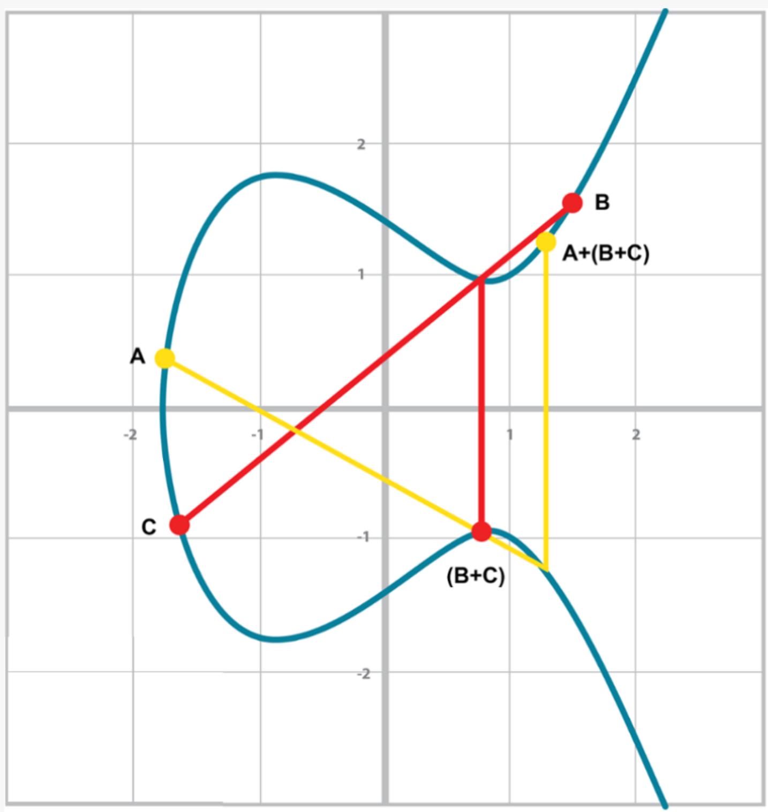

**original project:** [jimmysong - programming bitcoin](https://github.com/jimmysong/programmingbitcoin)

This is my own implementation in kotlin following the book: Programming Bitcoin - Jimmy Song

Thanks for your job Jimmy.

<h1>PROGRAMMING BITCOIN SUMMARY</h1>
<h2> Chapter 1 - Finite Fields </h2>
<h3>Finite Field Definition</h3>

Mathematically, a finite field is defined as a finite set of numbers and two operations + (addition) and ⋅ (multiplication) that satisfy the following:

```
1. If a and b are in the set, a + b and a ⋅ b are in the set. We call this property closed.
2. 0 exists and has the property a + 0 = a. We call this the additive identity.
3. 1 exists and has the property a ⋅ 1 = a. We call this the multiplicative identity.
4. If a is in the set, –a is in the set, which is defined as the value that makes a + (–a)
   = 0. This is what we call the additive inverse.
5. If a is in the set and is not 0, a–1 is in the set, which is defined as the value that
   makes a ⋅ a–1 = 1. This is what we call the multiplicative inverse.
```
In math notation the finite field set looks like this:
```
Fp = {0, 1, 2, ... p–1}
```

Field has a prime order every time. For a variety of reasons that will become clear later, it turns out that fields must have an order that is a power of a prime, and that the finite fields whose order is prime are the ones we’re interested in.

<h3>Modulo Arithmetic</h3>
The modulo operation is the remainder after division of one number by another.
```
1747 % 241 = 60
```
You can think of modulo arithmetic as “wraparound” or “clock” math.

Imagine a problem like this:
It is currently 3 o’clock. What hour will it be 47 hours from now?
The answer is 2 o’clock because

```
(3 + 47) % 12 = 2
```
The result of the modulo (%) operation for hours is always between 0 and 11

<h3>Finite Field Addition and Subtraction</h3>

```
Fp = {0, 1, 2, ... p–1}, where a, b ∈ Fp
```

Addition being closed means:

```
a + b = (a + b) % p, where a, b ∈ Fp
```

For example(p = 19):

```
7 + 8 = (7 + 8) % 19 = 15
```

Additive inverse this way. 

```
a ∈ Fp implies that –a ∈ Fp:
–a = (–a) % p
–9 = (–9) % 19 = 10
```

Field subtraction:

```
a – b = (a – b) % p, where a, b ∈ Fp.
```

For example(p = 19):

```
11 – 9 =(11 - 9) % 19 = 2
```

<h3>Finite Field Multiplication and Exponentiation</h3>
Examples for p = 19

Multiplication is adding multiple times:

```
5 ⋅ 3 = 5 + 5 + 5 = 15 % 19 = 15
8 ⋅ 17 = 8 + 8 + 8 + ... (17 total 8’s) ... + 8 = (8 ⋅ 17) % 19 = 136 % 19 = 3
```

Exponentiation using modulo arithmetic:]

```
7³ = 343 % 19 = 1
```

<h3>Finite Field Division</h3>
In normal math, division is the inverse of multiplication:

```
7 ⋅ 8 = 56 implies that 56/8 = 7
12 ⋅ 2 = 24 implies that 24/12 = 2
```

In F19, we know that:

```
3 ⋅ 7 = 21 % 19 = 2 implies that 2/7 = 3
9 ⋅ 5 = 45 % 19 = 7 implies that 7/5 = 9
```

The question you might be asking yourself is, how do I calculate 2/7 if I don’t know beforehand that 3 ⋅ 7 = 2?

the answer is that n^(p–1) is always 1 for every p that is prime and every n > 0. This is a beautiful result from number theory called *Fermat’s little theorem*. Essentially, the theorem says:

```
n^(p–1) % p = 1, where p is prime.
```

Because division is the inverse of multiplication, we know:

```
a/b = a ⋅ (1/b) = a ⋅ b⁻¹
```

We can reduce the division problem to a multiplication problem as long as we can figure out what b⁻¹ is. This is where *Fermat’s little theorem* comes into play. We know:

```
b^(p–1) = 1
```

because p is prime. Thus:

```
b⁻¹ = b⁻¹ ⋅ 1 = b⁻¹ ⋅ b^(p–1) = b^(p–2)
or:
b⁻¹ = b^(p–2)
```

F19:

```
2/7 = 2 ⋅ 7^(19 – 2) = 2 ⋅ 717 = 465261027974414 % 19 = 3
```

<h2>Chapter 2 - Elliptic Curves</h2>
<h3>Definition</h3>
elliptic curves have a form like this:

```
y² = x³ + ax + b
```


<h3>Point Addition</h3>
Elliptic curves are useful because of something called point addition. Point addition is where we can do an operation on two of the points on the curve and get a third point, also on the curve. This is called addition because the operation has a lot of the intuitions we associate with the mathematical operation of addition.

We can define point addition using the fact that lines intersect one or three times with the elliptic curve. Two points define a line, so since that line must intersect the curve one more time, that third point reflected over the x-axis is the result of the point addition.

So, for any two points P1 = (x1,y1) and P2 = (x2,y2), we get P1 + P2 as follows:

```
1. Find the point intersecting the elliptic curve a third time by drawing a line
through P1 and P2.
2. Reflect the resulting point over the x-axis.
```


One of the properties that we are going to use is that point addition is not easily predictable. We can calculate point addition easily enough with a formula, but intuitively, the result of point addition can be almost anywhere given two points on the curve.

A + B is to the right of both points, A + C would be somewhere between A and C on the x-axis, and B + C would be to the left of both points. In mathematics parlance, point addition is nonlinear.

<h3>Math of Point Addition</h3>
Point addition satisfies certain properties that we associate with addition, such as:

```
1. Identity
2. Commutativity
3. Associativity
4. Invertibility
```

Identity here means that there’s a zero. That is, there exists some point I that, when added to a point A, results in A:

```
I + A = A
```
Call this point the point at infinity.

This is related to invertibility. For some point A, there’s some other point –A that results in the identity point. That is:

```
A + (–A) = I
```

Visually, these points are opposite one another over the x-axis on the curve:


This is why we call this point the point at infinity. We have one extra point in the elliptic curve, which makes the vertical line intersect the curve a third time.

Commutativity means that:

```
A + B = B + A 
```

This is obvious since the line going through A and B will intersect the curve a third time in the same place, no matter the order.

Associativity means that:

```
(A + B) + C = A + (B + C)
```

This isn’t obvious and is the reason for flipping over the x-axis.





<h3>Point Addition for When x1 ≠ x2</h3>

```
P1 = (x1,y1), P2 = (x2,y2), P3 = (x3,y3)
P1 + P2 = P3
s = (y2 – y1)/(x2 – x1)
x3 = s² – x1 – x2
y3 = s(x1 – x3) – y1
```

<h3>Point Addition for When P1 = P2</h3>

When the x coordinates are the same and the y coordinate is different, we have the situation where the points are opposite each other over the x-axis. We know that this means:

```
P1 = –P2 or P1 + P2 = I
```

What happens when P1 = P2? Visually, we have to calculate the line that’s tangent to the curve at P1 and find the point at which the line intersects the curve.


```
P1 = (x1,y1), P3 = (x3,y3)
P1 + P1 = P3
s = (3x1² + a)/(2y1)
x3 = s² – 2 ⋅ x
y3 = s(x1 – x3) – y1
```

And this involves the case where the tangent line is vertical:


This can only happen if P1 = P2 and the y coordinate is 0, in which case the slope calculation will end up with a 0 in the denominator.

```
If the two points are equal and the y coordinate is 0, we return the point at infinity.
```